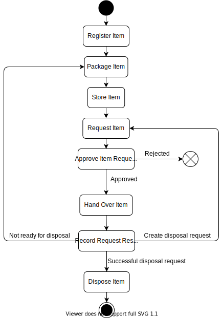

# StoreMan

> StoreMan is not a real computer system and it is not intended to develop the StoreMan system. The goal of this project is to show an example of how a system can be documented using Markdown documents and Draw.io / Diagrams.net diagrams.

## System Overview
StoreMan is a computer system designed for the registration and storage of property items in order to keep track of the items in terms of their current location. This location will either be a storage location where it is currently stored or a system user who checked the item out of storage for some purpose.

In order to remove an item from storage, a request needs to be logged and approved by a supervisor before it can be handed over to the user.

After the handover the user will perform the required actions according to the request and record the results of the request when they are done.

After request results are recorded, an item nned to be stored again, which is handled through the same request procedure. Any user in possession of an item can store the item in one of their registered storage locations.

When the organisation has no further use for the item, it needs to be disposed. Disposals are also handled through the request procedure.

StoreMan can be used in a wide array of environments ranging from simple examples like an informal library to complex environments like a Police crime scene exhibit store.

The diagrambelow provides a visual overview of the StoreMan process.

## Documentation
The documentation of the StoreMan systemcan be viewed [here](./documentation/README.md).