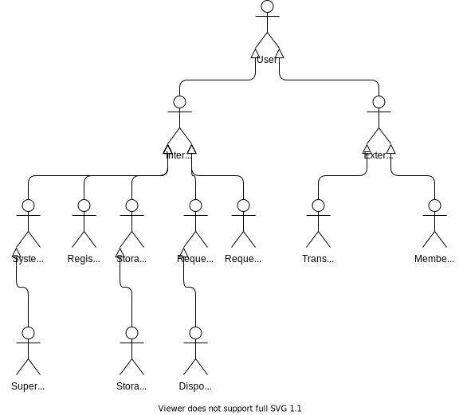

# Actors

A physical human user can play multiple roles when interacting with the system. We can say that they are acting in a specific role and therefore we refer to them as actors. A single human user can play multiple roles and thus be represented by multiple actors in the documentation.

The following diagram provides a breakdown of the various actors that have been identified.

