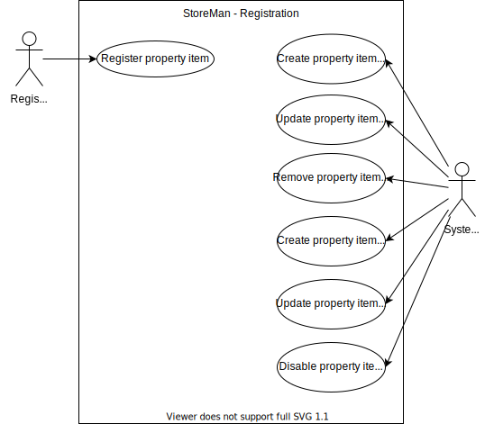

# Registration

## [Register property item](Register%20property%20item/README.md)
Every new property item that needs to be managed by the StoreMan system needs to be registered first so that StoreMan has knowledge of this property item.

## Create property item category
There are many types of property items that could potentially be managed by the system. Property items types will therefore be grouped into categories which group together related or similar proiperty item types. For example a category such as **Electronics** could group together property item types such as **TV**, **Cellular phone**, **Kitchen Appliance** etc.

## Update property item category
Property item categories could be updated with a new name that is more descriptive of the types of property items it contains.

## Remove property item category
Property item categories could be removed if the category does not contain any types. Thus if a category does contain types it cannot be removed and the contained types should first be updated to put them in a different category before the category could be removed.

## Create property item type
Every property item has a type which determines what type of property item it is and what data needs to be recorded for a collected about the property item. For example a **cellular phone** would be a property item category and we would collect details like in **IMEI number** for a cellular phone.

## Update property item type
A property item type can be updated with a different name and different attributes for which data needs to be collected. Whenever a property item type is updated, then existing property items of this type will not be affected.

## Disable property item type
Sometimes it is required to remove a property item type as these types of items will no longer be registered. Whenever a property item type is removed, existing property items of this type will not be removed.