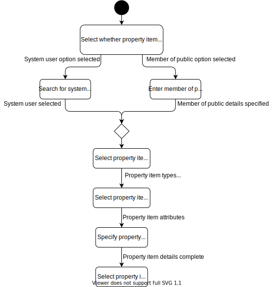

# Register property item
Every new property item that needs to be managed by the StoreMan system needs to be registered first so that StoreMan has knowledge of this property item.

## Actors
Registration Official

## Assumptions
- The user is logged in
- The user is authorised to register property items for the facility.

## Pre-conditions
None

## Post-conditions
- No unpackaged / labeled property items exist

## Activity diagram

## Main scenario

## Alternate scenarios

## Non functional requirements
- When a new property item is saved, the server should respond within 1 second.